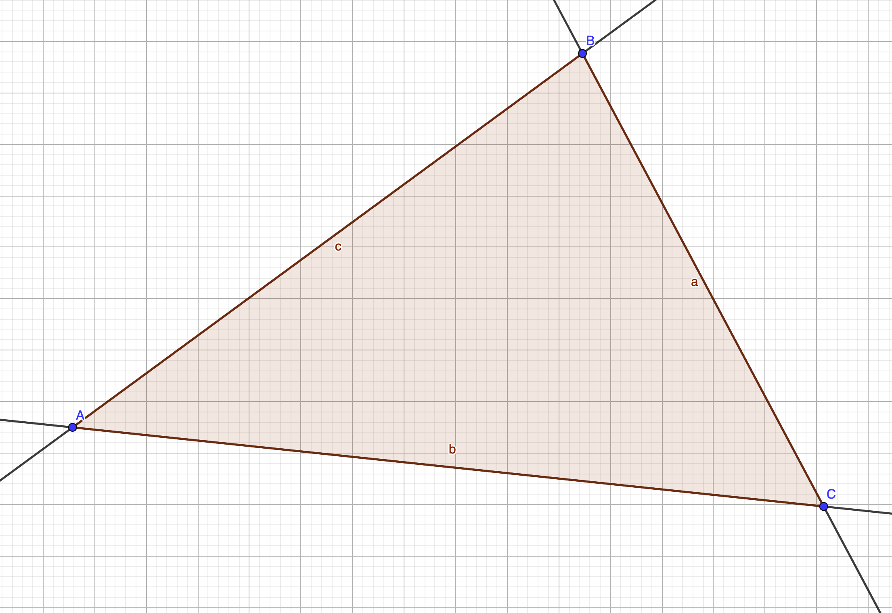
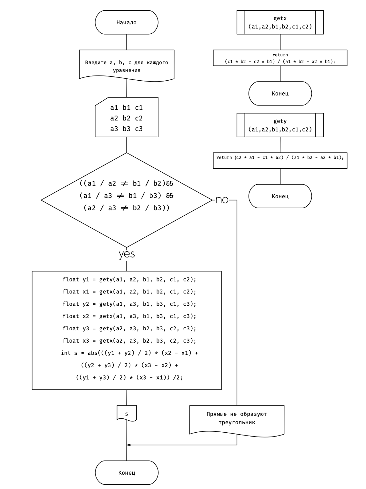
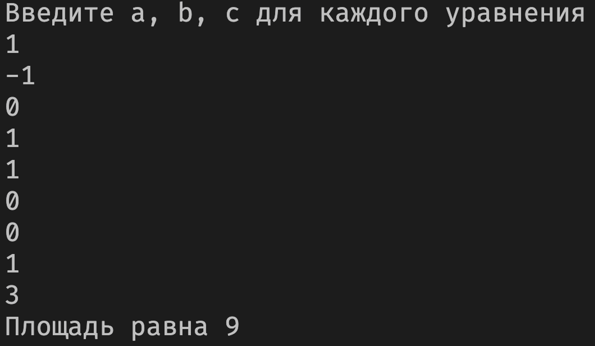

Задание
Три прямых на плоскости определяются уравнениями вида: $а_kx+b_ky=c_k$, где k=1...3. Определить площадь треугольника, образованного этими прямыми. В случае если прямые не образуют треугольника, выдать на печать сообщение.

Решение:

Для того чтобы вычислить площадь треугольника нам необходимо знать точки их пересечания прямых образующий трегульноник, если таких точек нет (прямые парралельны), то площадь вычислить невозможно.


1. Проверяем есть ли пересечения прямых
   ```cpp
   if ((a1 / a2 != b1 / b2) &&
        (a1 / a3 != b1 / b3) &&
        (a2 / a3 != b2 / b3))
   ```
2. Вычисляем пересения прямых
   ```cpp
   float getx(float a1, float a2,
           float b1, float b2,
           float c1, float c2)
    {
        return (c1 * b2 - c2 * b1) / (a1 * b2 - a2 * b1);
    };

    float gety(float a1, float a2,
            float b1, float b2,
            float c1, float c2)
    {

        return (c2 * a1 - c1 * a2) / (a1 * b2 - a2 * b1);
    };
   ```
3. Вычисляем площадь
   ```cpp
    int s = abs(((y1 + y2) / 2) * (x2 - x1) +
                    ((y2 + y3) / 2) * (x3 - x2) +
                    ((y1 + y3) / 2) * (x3 - x1)) /2;
    ```

Вот весь получившийся код с отладочной программой:
```cpp
#include <iostream>
using std::cout, std::cin;

float getx(float a1, float a2,
           float b1, float b2,
           float c1, float c2)
{
    return (c1 * b2 - c2 * b1) / (a1 * b2 - a2 * b1);
};

float gety(float a1, float a2,
           float b1, float b2,
           float c1, float c2)
{

    return (c2 * a1 - c1 * a2) / (a1 * b2 - a2 * b1);
};

int main()
{
    float a1, b1, c1, a2, b2, c2, a3, b3, c3;
    cout << "Введите a, b, c для каждого уравнения\n";
    cin >> a1 >> b1 >> c1 >> a2 >> b2 >> c2 >> a3 >> b3 >> c3;
    if ((a1 / a2 != b1 / b2) &&
        (a1 / a3 != b1 / b3) &&
        (a2 / a3 != b2 / b3))
    {
        float y1 = gety(a1, a2, b1, b2, c1, c2);
        float x1 = getx(a1, a2, b1, b2, c1, c2);
        float y2 = gety(a1, a3, b1, b3, c1, c3);
        float x2 = getx(a1, a3, b1, b3, c1, c3);
        float y3 = gety(a2, a3, b2, b3, c2, c3);
        float x3 = getx(a2, a3, b2, b3, c2, c3);
        int s = abs(((y1 + y2) / 2) * (x2 - x1) +
                    ((y2 + y3) / 2) * (x3 - x2) +
                    ((y1 + y3) / 2) * (x3 - x1)) /2;
        cout << "Площадь равна " << s << "\n";
    }
    else {
        cout << "Прямые не образуют треугольник \n";
    };
}
```



Вывод: Я научился использовать основные управляющие операторы C++