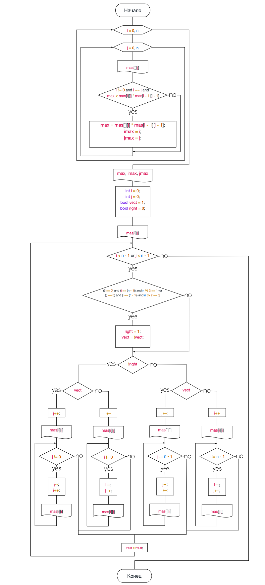
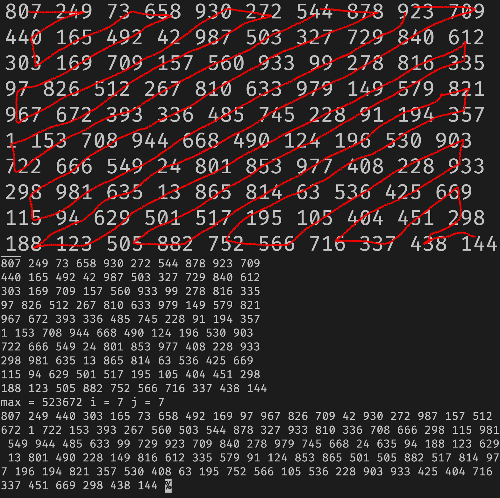

<!-- температурный резонанс теплоемкости -->

На главной диагонали матрицы $D(N,N)$ найти значение и номер элемента, произведение которого с предыдущим максимально. Распечатать:
1. исходную матрицу
2. значение найденного элемента
3. столбец и строку, на пересечении которых расположен найденный элемент
4. зигзагом вдоль главной диагонали все элемента, начиная с первого

Решение 

1. Создадим, заполним, выведем матрицу, найдем и выведем искомый элемент, столбец и строку, на пересечении которых расположен найденный элемент
   ```cpp
int mas[n][n];
for (int i = 0; i < n; i++)
{
    for (int j = 0; j < n; j++)
    {
        mas[i][j] = rand() % 1000;
        cout << mas[i][j] << " ";
        if (i != 0 and i == j and max < mas[i][j] * mas[i - 1][j - 1])
        {
            max = mas[i][j] * mas[i - 1][j - 1];
            imax = i;
            jmax = j;
        }
    }
    cout << "\n";
}
cout << "max = " << max << " i = " << imax << " j = " << jmax;
   ```
2. Зигзагом выведем все элементы
   Отметим, что, чтобы вывести зигзагом матрицу необходимо рассмотреть 4 случая:
   
   - Вывод еще не дошел до главной диагонали
     - Вывод идет вниз
     - Вывод идет вверх
   - Вывод еще не дошел до главной диагонали
     - Вывод идет вниз
     - Вывод идет вверх
  
   Все эти случаи были реализованы отдельно и введены с помощью системы флагов
   ```cpp
int i = 0;
int j = 0;
bool vect = 1;
bool right = 0;
cout << "\n"
     << mas[i][j] << " ";
while (i < n - 1 or j < n - 1)
{
    if (((i == 0) and (j == (n - 1)) and n % 2 == 1) or
        ((j == 0) and (i == (n - 1)) and n % 2 == 0))
    {
        right = 1;
        vect = !vect;
    }
    if (!right)
    {
        if (vect)
        {
            j++;
            cout << mas[i][j] << " ";
            while (j != 0)
            {
                j--;
                i++;
                cout << mas[i][j] << " ";
            };
        }
        else
        {
            i++;
            cout << mas[i][j] << " ";
            while (i != 0)
            {
                j++;
                i--;
                cout << mas[i][j] << " ";
            };
        };
    }
    else
    {
        if (vect)
        {
            j++;
            cout << mas[i][j] << " ";
            while (j != n - 1)
            {
                j++;
                i--;
                cout << mas[i][j] << " ";
            };
        }
        else
        {
            i++;
            cout << mas[i][j] << " ";
            while (i != n - 1)
            {
                j--;
                i++;
                cout << mas[i][j] << " ";
            };
        };
    };
    vect = !vect;
};
   ```

Вот полный код и тестирующая программа
```cpp
#include "iostream"
using std::cin, std::cout;
#define n 10

int main()
{
    int max = 0;
    int jmax{};
    int imax{};
    int mas[n][n];
    for (int i = 0; i < n; i++)
    {
        for (int j = 0; j < n; j++)
        {
            mas[i][j] = rand() % 1000;
            cout << mas[i][j] << " ";
            if (i != 0 and i == j and max < mas[i][j] * mas[i - 1][j - 1])
            {
                max = mas[i][j] * mas[i - 1][j - 1];
                imax = i;
                jmax = j;
            }
        }
        cout << "\n";
    }
    cout << "max = " << max << " i = " << imax << " j = " << jmax;
    int i = 0;
    int j = 0;
    bool vect = 1;
    bool right = 0;
    cout << "\n"
         << mas[i][j] << " ";
    while (i < n - 1 or j < n - 1)
    {
        if (((i == 0) and (j == (n - 1)) and n % 2 == 1) or
            ((j == 0) and (i == (n - 1)) and n % 2 == 0))
        {
            right = 1;
            vect = !vect;
        }
        if (!right)
        {
            if (vect)
            {
                j++;
                cout << mas[i][j] << " ";
                while (j != 0)
                {
                    j--;
                    i++;
                    cout << mas[i][j] << " ";
                };
            }
            else
            {
                i++;
                cout << mas[i][j] << " ";
                while (i != 0)
                {
                    j++;
                    i--;
                    cout << mas[i][j] << " ";
                };
            };
        }
        else
        {
            if (vect)
            {
                j++;
                cout << mas[i][j] << " ";
                while (j != n - 1)
                {
                    j++;
                    i--;
                    cout << mas[i][j] << " ";
                };
            }
            else
            {
                i++;
                cout << mas[i][j] << " ";
                while (i != n - 1)
                {
                    j--;
                    i++;
                    cout << mas[i][j] << " ";
                };
            };
        };
        vect = !vect;
    };
    return 0;
}
```


Вывод: Я научился работать с матрицами в C++