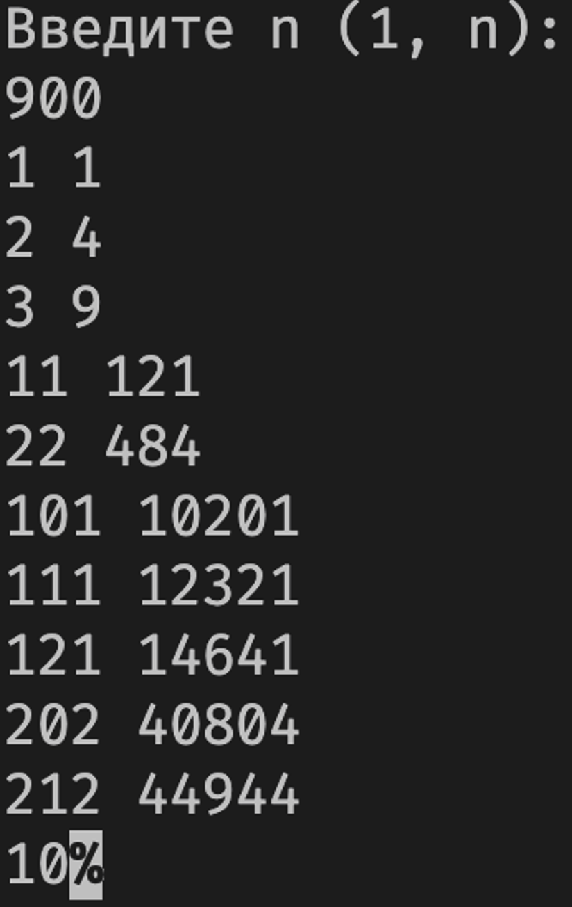
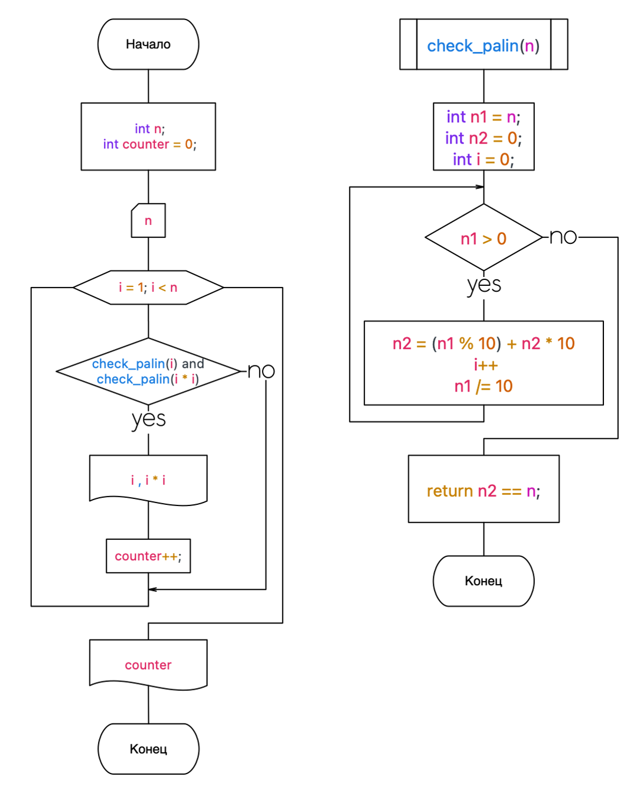

Задание
Написать программу, определяющую, сколько из чисел в диапазоне от 0 до n (n вводится с клавиатуры), сами являясь палиндромами, при  возведении в квадрат, образуют палиндромы. Например: 222 – 484 . Вывести на печать числа, квадраты и их количество.

Решение
1. Напишем функцию, которая проверяет является ли переданное ей число палиндромом.
   ```cpp
bool check_palin(int n)
{
    int n1 = n;
    int n2 = 0;
    int i = 0;
    while (n1 > 0)
    {
        n2 = (n1 % 10) + n2 * 10;
        i++;
        n1 /= 10;
    };
    return n2 == n;
};
    ```
2. Напишем цикл в котором будем проверять является ли число палиндромом и является ли его квадрат палиндромом. Если все ксловия соблюдены будем выводить число, квадрат и прибавлять к счетчику количества единицу.
   ```cpp
for (int i = 1; i < n; i++)
{
    if (check_palin(i) and check_palin(i * i))
    {
        cout << i << " " << i * i << "\n";
        counter++;
    };
}
   ```
3. Выведем полученное количество
   ```cpp
cout << counter;
   ```
Вот весь получившийся код и отладочная программа:
```cpp
#include "iostream"
using namespace std;
bool check_palin(int n)
{
    int n1 = n;
    int n2 = 0;
    int i = 0;
    while (n1 > 0)
    {
        n2 = (n1 % 10) + n2 * 10;
        i++;
        n1 /= 10;
    };
    return n2 == n;
};
int main()
{
    int n;
    cout << "Введите n (1, n):\n";
    cin >> n;
    int counter = 0;
    for (int i = 1; i < n; i++)
    {
        if (check_palin(i) and check_palin(i * i))
        {
            cout << i << " " << i * i << "\n";
            counter++;
        };
    }
    cout << counter;
    return 0; 
};
```



Вывод: я научился программировать функции.