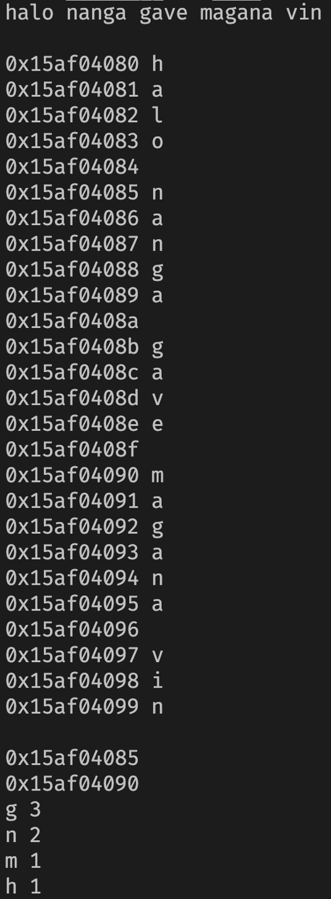
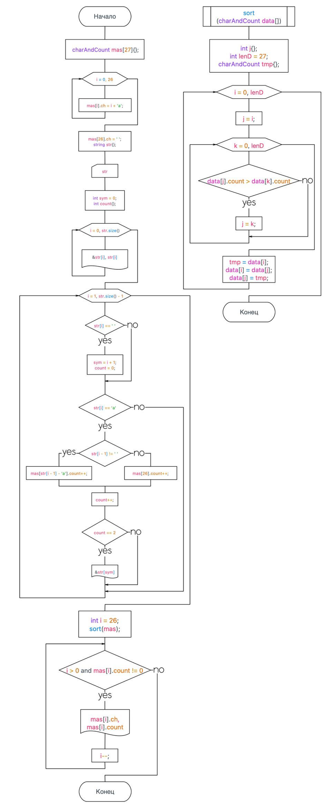

Задание

В заданном тексте, содержащем не менее 5 слов, найти буквы, за которыми следует буква а. Вывести найденные буквы в порядке, обратном частоте их встречаемости в тексте. Пользуясь указателями, вывести адреса тех слов, в которых буква а встречается более 2 раз.

Решение

1. Для начала создадим структуру с полями целочисленного и буквенного типа

   ``` cpp
    struct charAndCount
    {
        char ch;
        int count;
    };
   ```
2. Создадим 27 символьный массив и запишем в него 26 букв латинского алавита и пробел.
   ```cpp
    charAndCount mas[27]{};
    for (int i{}; i < 26; i++)
    {
        mas[i].ch = i + 'a';
    };
    mas[26].ch = ' ';
   ```
4. Получим всю строку введенную пользователем.
   ```cpp
    getline(cin, str, '\n');
   ```
5. Для отслеживания выведем все буквы и их адреса в памяти.
   ```cpp
    for (int i = 0; i < str.size(); i++)
        cout << static_cast<void *>(&str[i]) << " " << str[i] << "\n";
   ```
6. Пройдем циклом по всей строке и запомним в массив созданный в пункте 2 количество каждой буквы стоящей перед буквой а, одновременно с этим выведем каждую букву которая достигнет значения 2.
   ```cpp
    for (int i = 1; i < str.size() - 1; i++)
    {
        if (str[i] == ' ')
        {
            sym = i + 1;
            count = 0;
        };
        if (str[i] == 'a')
        {
            if (str[i - 1] != ' ')
                mas[str[i - 1] - 'a'].count++;
            else
                mas[26].count++;
            count++;
            if (count == 2)
                cout << static_cast<void *>(&str[sym]) << "\n";
        };
    };
   ```
7. Создадим функцию сортировки и отсортируем массив.
   ```cpp
    void sort(charAndCount data[])
    {
        int j{};
        int lenD = 27;
        charAndCount tmp{};
        for (int i = 0; i < lenD; i++)
        {
            j = i;
            for (int k = i; k < lenD; k++)
            {
                if (data[j].count > data[k].count)
                {
                    j = k;
                }
            }
            tmp = data[i];
            data[i] = data[j];
            data[j] = tmp;
        }
    }
   ```
8. Выведем массив.
   ```cpp
    while (i > 0 and mas[i].count != 0)
    {
        cout << mas[i].ch << " " << mas[i].count << "\n";
        i--;
    };
   ```
Вот программа и тестирующая функция:
```cpp
#include "iostream"
#include "string"
#include "stdio.h"
using std::string, std::cout, std::cin, std::size, std::getline;

struct charAndCount
{
    char ch;
    int count;
};

void sort(charAndCount data[])
{
    int j{};
    int lenD = 27;
    charAndCount tmp{};
    for (int i = 0; i < lenD; i++)
    {
        j = i;
        for (int k = i; k < lenD; k++)
        {
            if (data[j].count > data[k].count)
            {
                j = k;
            }
        }
        tmp = data[i];
        data[i] = data[j];
        data[j] = tmp;
    }
}

int main()
{
    charAndCount mas[27]{};
    for (int i{}; i < 26; i++)
    {
        mas[i].ch = i + 'a';
    };
    mas[26].ch = ' ';
    string str{};
    getline(cin, str, '\n');
    cout << "\n";
    int sym = 0;
    int count{};
    for (int i = 0; i < str.size(); i++)
    {
        cout << static_cast<void *>(&str[i]) << " " << str[i] << "\n";
    };
    cout << "\n";
    for (int i = 1; i < str.size() - 1; i++)
    {
        if (str[i] == ' ')
        {
            sym = i + 1;
            count = 0;
        };
        if (str[i] == 'a')
        {
            if (str[i - 1] != ' ')
                mas[str[i - 1] - 'a'].count++;
            else
                mas[26].count++;
            count++;
            if (count == 2)
                cout << static_cast<void *>(&str[sym]) << "\n";
        };
    };
    int i = 26;
    sort(mas);
    while (i > 0 and mas[i].count != 0)
    {
        cout << mas[i].ch << " " << mas[i].count << "\n";
        i--;
    };

    return 0;
};

```


Вывод: Я научился использовать указатели при работе со строками в C++