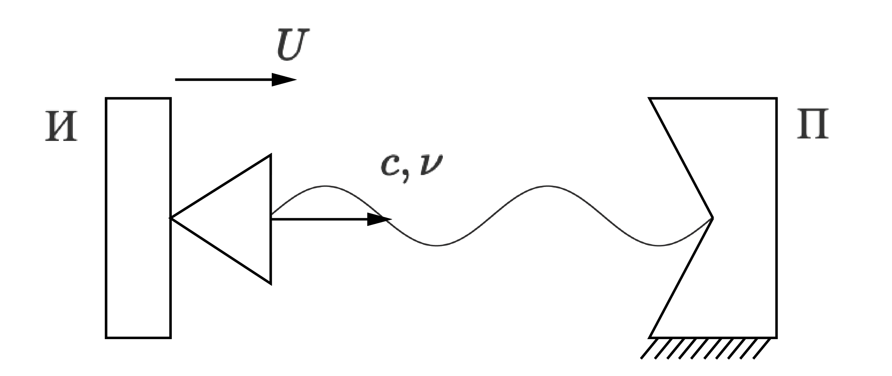
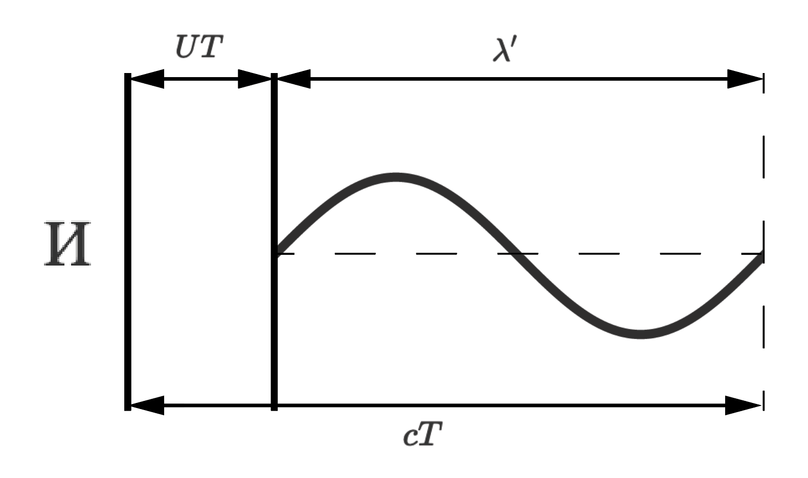
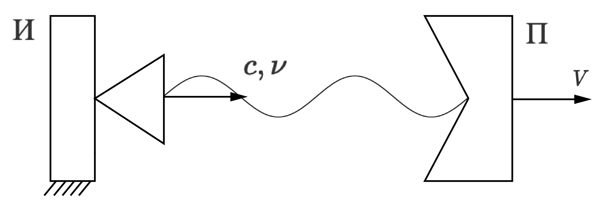
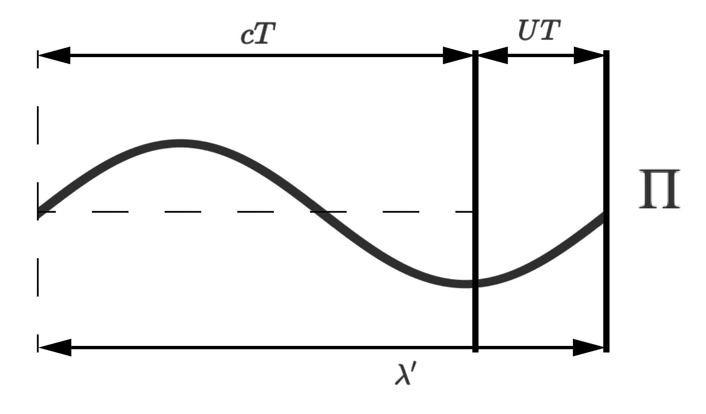

# Поперечный эффект Доплера

## 1. История открытия

Кристиан Доплер (1803-1853), уроженец Австрии, был учителем математики, он хотел полностью понять геометрию и математические концепции, которым он учил.

К концу 1830-х годов поезда, способные развивать скорость свыше 50 км в час, мчались по сельской местности. Эти поезда сделали звуковое явление заметным впервые. Поезда позволяли людям замечать влияние движения объекта на звуки, производимые объектом.

Доплер внимательно наблюдал за проходящими поездами и начал рассуждать о том, что вызвало звуковые сдвиги, которые он наблюдал. К 1843 году Доплер расширил свои идеи, включив световые волны, и разработал общую теорию, в которой утверждалось, что движение объекта либо увеличивает, либо уменьшает частоту звука и света, производимых им, как измеряется стационарным наблюдателем. Доплер утверждал, что этот сдвиг может объяснить красный и синий оттенок света отдаленных двойных звезд.

В статье, которую он представил Богемскому научному обществу в 1844 году, Доплер представил свою теорию о том, что движение объектов, движущихся к наблюдателю, сжимает звуковые и световые волны, так что они, по-видимому, переходят в более высокий тон и в более высокочастотный цвет (синий). Обратное произошло, если объект удалялся (смещение в сторону красного). Он утверждал, что это объясняет часто наблюдаемый красный и синий оттенок света многих далеких звезд. Хотя это технически правильно, этот сдвиг был бы слишком мал, чтобы его инструменты могли это обнаружить.

Допплеру было предложено доказать свою теорию. Поскольку телескопы и измерительное оборудование не были достаточно сложными, он решил продемонстрировать свой принцип со звуком.

В своем знаменитом эксперименте 1845 года  Доплер набрал несколько музыкантов и разделил их на 2 группы. Первая группа ехала в поезде и играла одну и ту же ноту, а вторая стояла на краю платформы и записывала услышанную ноту. Эксперемент проводился в 2 этапа: в начале поезд подошел к платформе, а затем отступил от нее. То, что записали музыканты из второй группы, было сначала немного выше, а затем немного ниже, чем то, что фактически играли музыканты из первой.

Доплер повторил эксперимент, но музыканты на станции теперь тоже играли ту же ноту, что и музыканты из первой группы. Было четко слышно, что ноты звучали по-разному. Движущиеся и неподвижные ноты, казалось, мешали друг другу, настраивая пульсирующий ритм (биения).

Доказав существование своего эффекта, Допплер назвал его доплеровским сдвигом.

## 2. Определение, формулы и доказательства

**Эффект Доплера** - эффект изменения частоты волны, регистрируемой приемником, в следствие движения источника волны и (или) приемника.

Введем некоторые обозначения:
$U$ - скорость источника распространения волны
$V$ - скорость приемника волны
$\nu$ - частота выходной волны
$\nu'$ - частота принятой волны
$c$ - скорость распространения волны

Для начала следует сказать, что эффект Доплера будет поисходить только при движении источника волны или приемника, т.е. когда приемник и источник покоятся эффект доплера происходить не будет.
$$\begin{rcases}
U = 0\\
V = 0
\end{rcases}\Rightarrow\nu = \nu'$$

Поэтому рассмотим 3 случая:

### Случай 1. Источник движется с постоянной скоростью $U \ne 0$, а приемник покоится $V = 0$.

Пусть из источника в момент времени $t = 0$ начал выходить передний фронт синусоидальной волны. Но при этом источник движется. Получается за период волны $T$ источник передвинется на расстояние $UT$, а передний фронт волны пройдет расстояние $cT$. Расстояние от конца волны до ее начала назовем длиной волны и обозначим $\lambda'$. Расстояние пройденное передним фронтом волны $cT$ будет равно сумме расстояния которое прошел источник $UT$ и длине волны $\lambda'$.

$$cT = UT + \lambda'$$

Таким образом можно считать, что волна сжалась.
Выразим длину волны:

$$\lambda' = cT - UT = T(c - U)$$
$$\nu' = \frac{c}{\lambda'} = \frac{c}{T(c - U)} = \frac{\frac{1}{T}}{1 - \frac{U}{c}} = \frac{\nu}{1 - \frac{U}{c}}$$
$$\nu' = \frac{\nu}{1 - \frac{U}{c}}$$

### Случай 2. Источник покоится $U = 0$, а приемник движется с постоянной скоростью $V \ne 0$.

Пусть в момент времени $t = 0$ передний фронт достиг приемника. Далее приемник будет двигаться вперед, постеменно принимая волну, окончательно этот прием закончится когда задний фронт фолны дойдет до приемника, т.е. через $T$ секунд. За это время приемник сместится на $VT$. Тогда длина волны $\lambda'$ будет равна сумме расстояния которое прошла волна $cT$ и расстояния которое прошел приемник $VT$.

$$\lambda' = cT+UT = T(c+U)$$

Таким образом можно считать, что волна растянулась.

$$\nu' = \frac{c}{\lambda} = \frac{c}{T(c+U)} = \frac{\frac{1}{T}}{1+\frac{U}{c}} = \frac{\nu}{1+\frac{U}{c}}$$
$$\nu' = \frac{\nu}{1 + \frac{U}{c}}$$

<!-- $$
U\\
И\\
c, \nu\\
П\\
\lambda'\\
cT\\
UT\\
V\\
$$ -->